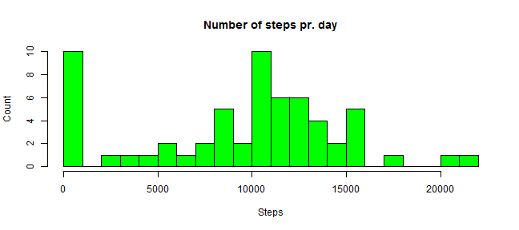
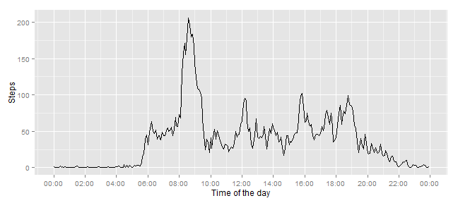
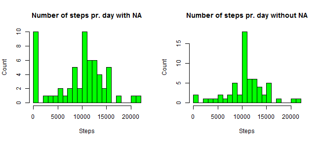
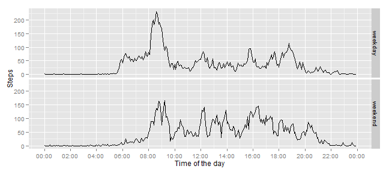

# Reproducible Research: Peer Assessment 1
This paper will look into a sample collected over a two-month period, October
and November 2012. The data consists of 5 minutes intervals counting the steps
the subject took.   
We will process the data, looking at what the mean and the median number of 
steps pr. day is, along with imputing missing data in order to enhance the 
precision of the dataset. Lastly, we will look at how the number of steps
differ from weekend to weekdays.

We start off by setting some global options.


```r
library(ggplot2)
```

```
## Need help? Try the ggplot2 mailing list: http://groups.google.com/group/ggplot2.
```

```r
library(scales) ## For the scale_x_datetime
library(knitr)

opts_chunk$set(fig.width=9, fig.height=4)
options(scipen=6) ## Ensures that scientific notation isn't to lenient. 
```


## Loading and preprocessing the data
As the data comes in a .zip format, we will unzip the data, load it, read it
and delete the unzipped folder.
For this to work the working directory must be set to the 
*RepData_PeerAssessment1* folder.


```r
permwd <- getwd() ## As we change the wd, we keep the original
temp <- tempfile()
unzip("activity.zip", exdir=temp)
setwd(temp) 
df <- read.csv(file="activity.csv", colClasses = 
                       c("integer", "factor", "character"))
## Converts the intervals into true time stamps and makes them a factor
df$interval <- as.character(sapply(df$interval, function(input) {

        if(nchar(input) == 1) {
                paste("00", paste("0", input, sep=""), sep=":")
        }

        else if (nchar(input) == 2) {
                paste("00", input, sep=":")
        }

        else if(nchar(input)==3) {
                paste(paste("0", substr(input, start=1, stop=1), sep=""), 
                      substr(input, start=2, stop=3), sep=":")
        }

        else if(nchar(input)==4) {
                paste(substr(input, start=1, stop=2), 
                      substr(input, start=3, stop=4), sep=":")
        }
}))
df$interval <- factor(x=df$interval, levels=df$interval[1:288]) 

unlink(temp, recursive=TRUE) ## Deletes the temp file
setwd(permwd)
```

## What is mean total number of steps taken per day?
Now that we have loaded the data, we want to look at the mean steps taken pr.
day. For this we will use the tapply function to sum the days and the baseplot
to construct a histogram.


```r
stepsum <- as.numeric(tapply(df$step, df$date, sum, na.rm=TRUE))
hist(stepsum, breaks=20, main = "Number of steps pr. day", xlab="Steps", 
     ylab="Count", col="green")
```

 

```r
meanstep <- round(mean(stepsum), 2)
medianstep <- median(stepsum)
```

We can see that the mean is 9354.23 and the median is 10395. 


## What is the average daily activity pattern?
Next we will look at the daily activity pattern. Specifically, we will look at 
which interval across all the days have the most activity. We start off by 
summing the steps for each interval and then print them to a graph.

```r
intervalmean <- tapply(df$steps, df$interval, mean, na.rm=TRUE)
                          
ggplot(df, aes(x=as.POSIXct(levels(df$interval), format="%H:%M"), 
               y=as.numeric(intervalmean))) + 
                geom_line() + 
                scale_x_datetime(labels = date_format("%H:%M"), 
                                breaks=date_breaks("2 hour")) +
        xlab("Time of the day") + 
        ylab("Steps")
```

 

```r
maxstep <- intervalmean[which.max(as.numeric(intervalmean))]
intervalmaxstep <- names(intervalmean[which.max(as.numeric(intervalmean))])
```
Furthermore, we see that the average maximum amount of steps is at
08:35 with 206.17 steps. 


## Imputing missing values
In this section we will look at how the missing values (defined as NA in the 
dataset) affects our statistical analysis. We will start by computing the total
number of missing values, then devise a strategy for replacing the NA's with
some appropriate value. We then make another histogram and compare it to the old
one to see if we find any difference. Lastly, we calculate the mean and the 
median.


```r
numberna <- sum(is.na(df$steps))
```
We see there are exactly 2304 of rows with NA's.   
Now, our strategy for filling in these NA's are taking the average of the 
interval to which they belong. We have already computed the interval mean 
previously, and we will use these values.


```r
dfNA <- df
stepsna <- is.na(dfNA$steps)

for(i in 1:nrow(dfNA)) {
        
        if (stepsna[i]) {
                dfNA$steps[i] = intervalmean[dfNA[i,3]]
        }
}

par(mfrow=c(1,2))
hist(stepsum, breaks=20, main = "Number of steps pr. day with NA", xlab="Steps", 
     ylab="Count", col="green")
stepsumNoNA <- as.numeric(tapply(dfNA$step, df$date, sum))
hist(stepsumNoNA, breaks=20, main = "Number of steps pr. day without NA", xlab="Steps", 
     ylab="Count", col="green")
```

 

```r
stepmeanNA <- mean(stepsumNoNA)
stepmedianNA <- median(stepsumNoNA)
```
We see that there are some difference between the plots, though not a lot. We 
see that by far the most common is around 11.000 steps, and that the amount
of days with no steps has been drastically reduced. THis is probably due to the
fact that quite a few of the days that were counted as 0 had a lot of NA's,
which has now been removed.

We see that the original mean was 9354.23 and median 10395,
whereas the new mean is 10766.1887 and new median is 10766.1887.
We see that the two mean and median are practially identical, which would 
suggest a normal distribution. This could very well be.

## Are there differences in activity patterns between weekdays and weekends?,
In this section we will investigate into whether there is a difference between
weekend and weekdays. We will do this by using a panel time series plot.


```r
posixdate <- as.POSIXlt(dfNA$date)
weekday <- posixdate$wday

for (i in 1:length(weekday)) {
        if (weekday[i] == 0 | weekday[i] == 6) {
                dfNA$weekday[i] = "weekend"
                }
        
        else {dfNA$weekday[i] = "weekday"}
}
dfNA$weekday <- as.factor(dfNA$weekday)

dfsplit <- split(dfNA, dfNA$weekday)


intervalweekday <- tapply(dfsplit[[1]][["steps"]], 
                          dfsplit[[1]][["interval"]], mean)

intervalweekend <- tapply(dfsplit[[2]][["steps"]], 
                          dfsplit[[2]][["interval"]], mean)

dfweekday <- data.frame(interval=names(intervalweekday), 
                        val=intervalweekday, 
                        weekday="weekday")

dfweekend <- data.frame(interval=names(intervalweekend), 
                        val=intervalweekend, 
                        weekday="weekend")
dfcomplete <- rbind(dfweekday, dfweekend)

ggplot(dfcomplete, aes(x=as.POSIXct(interval, format="%H:%M"), 
               y=as.numeric(val))) + 
                geom_line() + 
                scale_x_datetime(labels = date_format("%H:%M"), 
                                breaks=date_breaks("2 hour")) +
        xlab("Time of the day") + 
        ylab("Steps") + facet_grid(weekday ~ .)
```

 

As we can see from the above, there is somewhat different, but we still see the
heaviest activity around 08:00 to 10:00 in the morning. 


